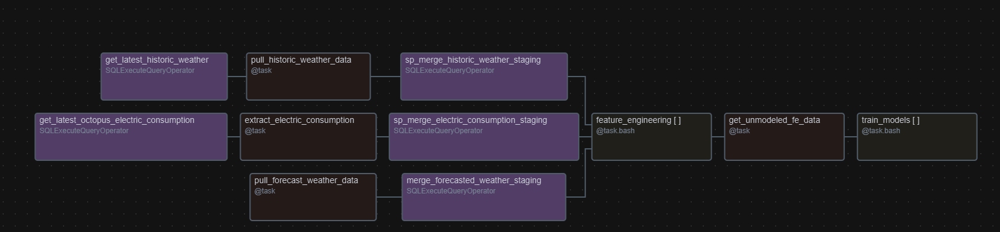

# Octopus Energy Forecasting DAG

This project is a **proof of concept (PoC)** DAG designed to demonstrate how Apache Airflow can orchestrate MLOps workflows. The DAG automates the end-to-end pipeline for data ingestion, transformation, feature engineering, and model training using Octopus Energy consumption and weather data.

## DAG Overview



The DAG, `octopus_consumption`, is scheduled to run hourly and consists of the following tasks:

### 1. **Get Latest Interval Start for Electricity Consumption**
   - Queries the database to fetch the latest interval start date for electricity consumption data.

### 2. **Extract Electricity Consumption Data**
   - Fetches electricity consumption data from the Octopus Energy API.
   - Stores the data in a staging table in the PostgreSQL database.

### 3. **Merge Electricity Consumption Data**
   - Merges the staging data into the main electricity consumption table.

### 4. **Get Latest Time Start for Historic Weather Data**
   - Queries the database to fetch the latest time start for historic weather data.

### 5. **Pull Historic Weather Data**
   - Fetches historic weather data from the Open-Meteo API.
   - Stores the data in a staging table in the PostgreSQL database.

### 6. **Merge Historic Weather Data**
   - Merges the staging data into the main historic weather table.

### 7. **Pull Forecasted Weather Data**
   - Fetches forecasted weather data from the Open-Meteo API.
   - Stores the data in a staging table in the PostgreSQL database.

### 8. **Merge Forecasted Weather Data**
   - Merges the staging data into the main forecasted weather table.

### 9. **Feature Engineering**
   - Executes Python scripts to perform feature engineering on the data.
   - Saves the processed data to Azure Blob Storage.

### 10. **Identify Unmodeled Feature Engineering Data**
   - Identifies feature engineering files that have not yet been used for model training.

### 11. **Train Models**
   - Trains forecasting models using the feature-engineered data.
   - Saves the model predictions to Azure Blob Storage.

## Key Features

- **MLOps Orchestration**: Demonstrates how Airflow can be used to orchestrate MLOps workflows, including data ingestion, transformation, and model training.
- **Data Ingestion**: Automates the extraction of electricity consumption and weather data from APIs.
- **Data Transformation**: Performs feature engineering to create time-based and weather-related features.
- **Model Training**:
  - **Linear Regression**: A simple baseline model for forecasting.
  - **SARIMAX**: A more advanced time-series forecasting model that supports exogenous variables.
  - **Genetic Algorithm for Feature Selection**: Optimizes feature selection for both models by minimizing the root mean squared error (RMSE).
- **Cloud Integration**: Stores processed data and model outputs in Azure Blob Storage.

## Prerequisites

- **Airflow**: Ensure Airflow is installed and configured.
- **PostgreSQL**: A PostgreSQL database is required for storing and processing data.
- **Azure Blob Storage**: Used for storing feature-engineered data and model outputs.
- **APIs**:
  - Octopus Energy API for electricity consumption data.
  - Open-Meteo API for weather data.

## How to Run

1. **Set Up Airflow Variables**:
   - `mpan`: Meter Point Administration Number.
   - `serial`: Meter serial number.
   - `octupus_api_key`: API key for Octopus Energy.

2. **Configure Connections**:
   - `OctopusEnergy_PG`: PostgreSQL connection for the database.
   - `azure_blob_dev`: Azure Blob Storage connection.

3. **Deploy the DAG**:
   - Place the repository in the Airflow DAGs directory.
   - Ensure all feature engineering and model training scripts are in their respective directories.

4. **Trigger the DAG**:
   - Trigger the DAG manually or let it run on its scheduled interval.

## Directory Structure

```
PortfolioProjects/
├── OctopusEnergy/
│   ├── README.md
│   ├── consumption_dag.py
│   ├── feature_engineering/
│   │   ├── fe_1.py
│   │   ├── fe_2.py
│   ├── model_training/
│   │   ├── linreg.py
│   │   ├── sarimax.py
```

## Future Enhancements

- Add additional forecasting models.
- Implement real-time data streaming for consumption and weather data.
- Enhance error handling and logging for better monitoring.
- Add performance reporting pipelines.

## Contact

For any questions or issues, please contact the project maintainer.
